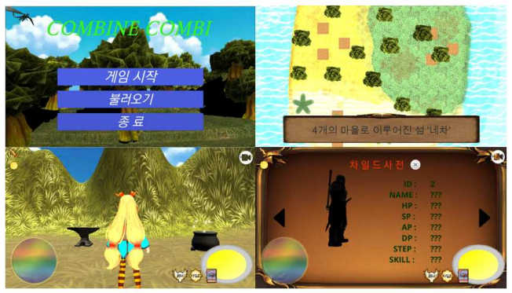
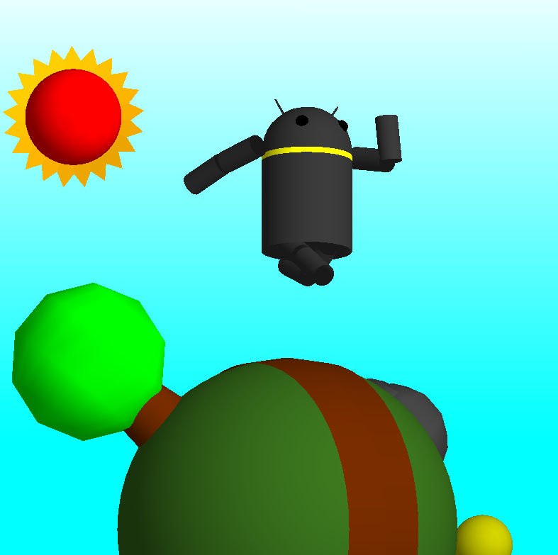

<h1>프로젝트 목록</h1>


1. [Unity - 딥러닝 기반 손 제스처 인식을 통한 3D 게임](#딥러닝-기반-손-제스처-인식을-통한-3D-게임)
2. [Unity - 몬스터 수집 RPG 게임](#몬스터-수집-RPG-게임)
3. [MFC - 포켓몬스터](#포켓몬스터)
4. [OpenGL -  로봇 애니메이션](#로봇-애니메이션)


## 딥러닝 기반 손 제스처 인식을 통한 3D 게임


```
딥러닝으로 손 제스처를 인식한 결과를 게임의 인터페이스로 활용하여 몰려오는 몬스터들을 물리치는 VR 게임입니다.
```


<h3>프로젝트 개요</h3>

<div align="center">
    
    
    
    
    
    
    
</div>

- #### 프로젝트 기간 - 2018.01 ~ 2018.12


- #### 신경망 구조


```
정적 제스처와 동적 제스처를 모두 분류하기 위하여 공간적인 특징만을 고려하는 기존의 DenseNet에 시간상의 정보를 고려할 수 있도록 차원을 확장한 3D DenseNet 구조를 설계하였습니다.
```


- #### 데이터 세트

  

  

```
손 제스처 데이터를 사용하기 위해 직접 300,000장의 데이터를 제작하였습니다.
```


- #### <a href="https://github.com/MrCodeMania/Portfolio_Game/tree/master/Unity_DeepLearning_VR_Game/Demo_Play.mp4">데모 영상</a>


- #### <a href="https://github.com/MrCodeMania/Portfolio_Game/tree/master/Unity_DeepLearning_VR_Game/딥러닝 기반 손 제스처 인식을 통한 3D 가상현실 게임.hwp">관련 논문</a>


------


## 몬스터 수집 RPG 게임

```
몬스터를 조합하여 새로운 몬스터를 얻고 이야기를 진행하는 게임입니다.
```


<h3>프로젝트 개요</h3>

<div align="center">
    
    
    
    
</div>


- #### 프로젝트 기간 - 2017.09 ~ 2017.12




- #### <a href="https://github.com/MrCodeMania/Portfolio_Game/tree/master/Unity_Collectible_Game/Combine_Combi_게임기획서.hwp">게임 기획서</a>


- #### <a href="https://github.com/MrCodeMania/Portfolio_Game/tree/master/Unity_Collectible_Game/Combine_combi_Intro.mp4">인트로 영상</a>


------


## 포켓몬스터

```
MFC를 사용해 기존보다 역동적인 포켓몬스터를 제작했습니다.
```


<h3>프로젝트 개요</h3>

<div align="center">
    
    
    
    
</div>


- #### 프로젝트 기간 - 2017.04 ~ 2017.05


- #### 실행방법 - Debug/Bhzzang.exe

  


------


## 로봇 애니메이션

```
OpenGL 라이브러리를 사용해 간단한 로봇 애니메이션을 제작했습니다.
```


<h3>프로젝트 개요</h3>

<div align="center">
    
    
    
    
</div>


- #### 프로젝트 기간 - 2017.05 ~ 2017.06




- #### 실행방법 - Debug/BhProject.exe

  