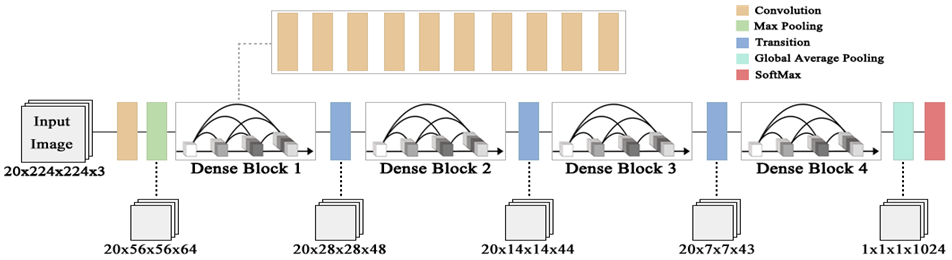

<h2>딥러닝 기반 손 제스처 인식을 통한 3D 게임 </h3>

```
딥러닝으로 손 제스처를 인식한 결과를 게임의 인터페이스로 활용하여 몰려오는 몬스터들을 물리치는 VR 게임입니다.
```


<h2>프로젝트 개요</h2>

<div align="center">
    
    
    
    
    
    
    
</div>

- #### 프로젝트 기간 - 2018.01 ~ 2018.12


- #### 신경망 구조



```
정적 제스처와 동적 제스처를 모두 분류하기 위하여 공간적인 특징만을 고려하는 기존의 DenseNet에 시간상의 정보를 고려할 수 있도록 차원을 확장한 3D DenseNet 구조를 설계하였습니다.
```


- #### 데이터 세트

  

  

```
손 제스처 데이터를 사용하기 위해 직접 300,000장의 데이터를 제작하였습니다.
```


- #### <a href="https://github.com/MrCodeMania/Portfolio_Game/tree/master/Unity_DeepLearning_VR_Game/Demo_Play.mp4">데모 영상</a>


- #### <a href="https://github.com/MrCodeMania/Portfolio_Game/tree/master/Unity_DeepLearning_VR_Game/딥러닝 기반 손 제스처 인식을 통한 3D 가상현실 게임.hwp">관련 논문</a>


------


<h2>